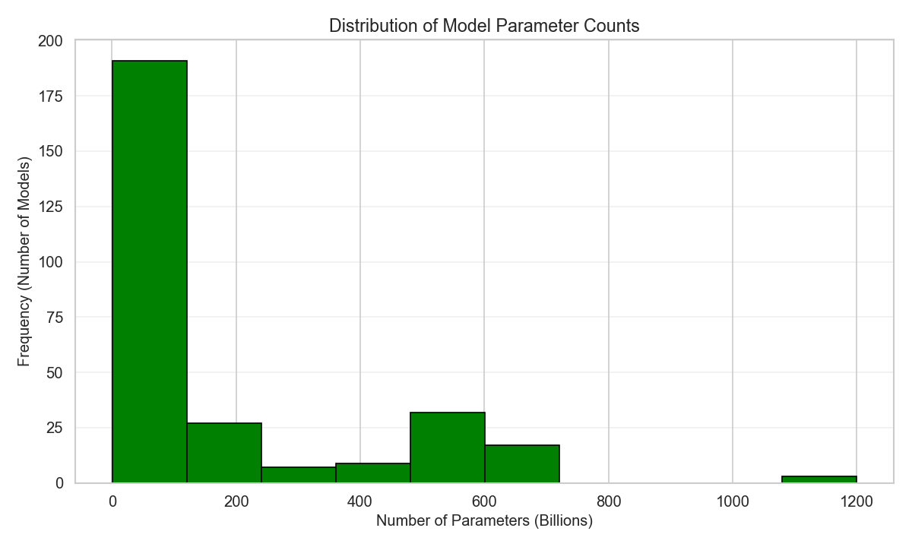
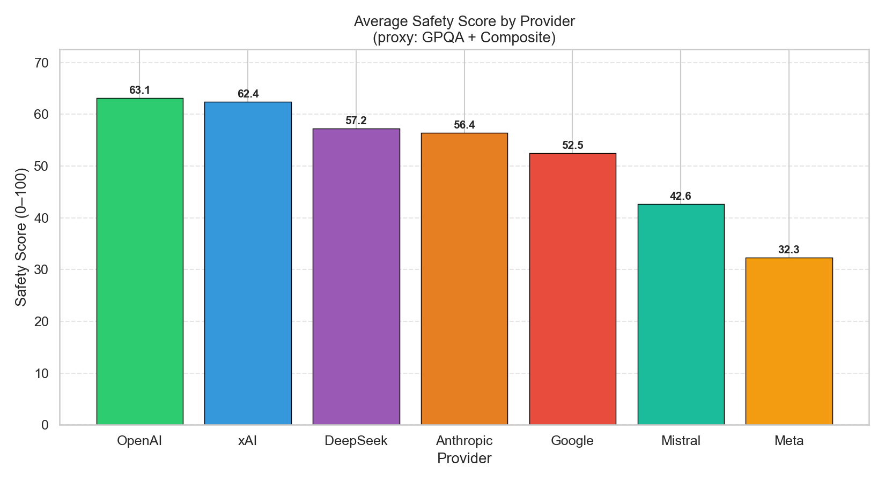
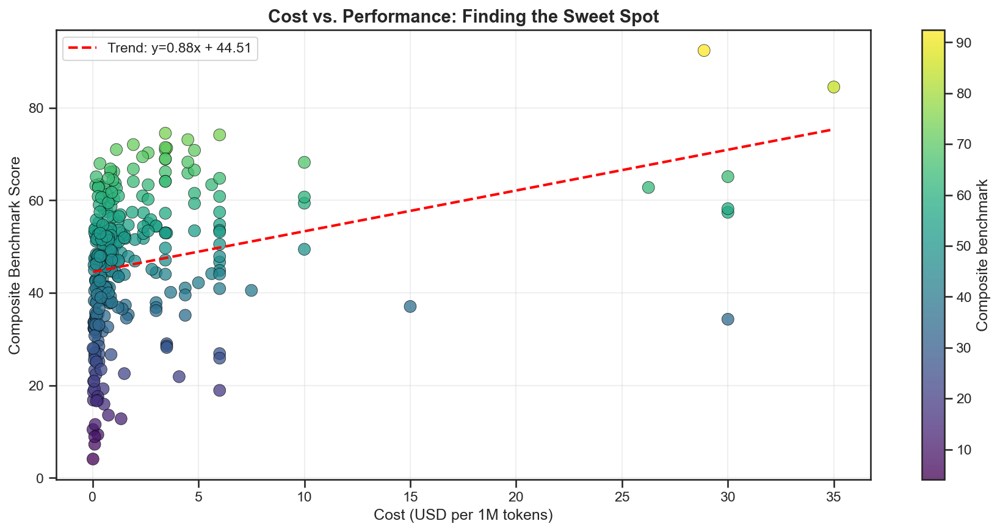
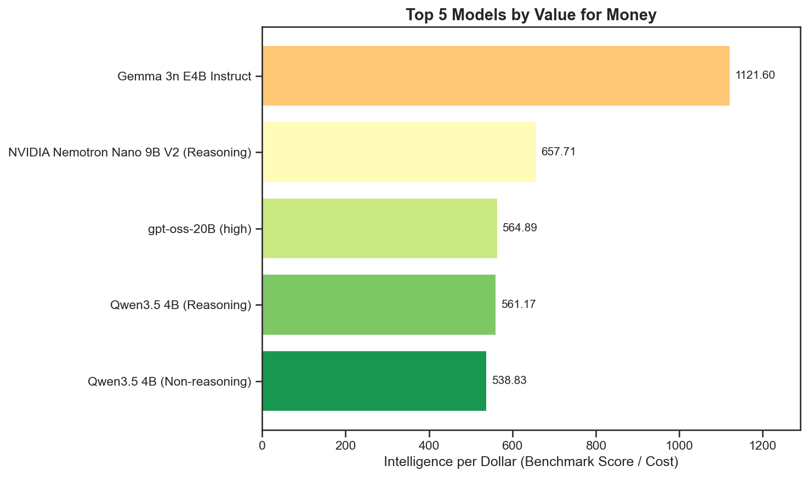
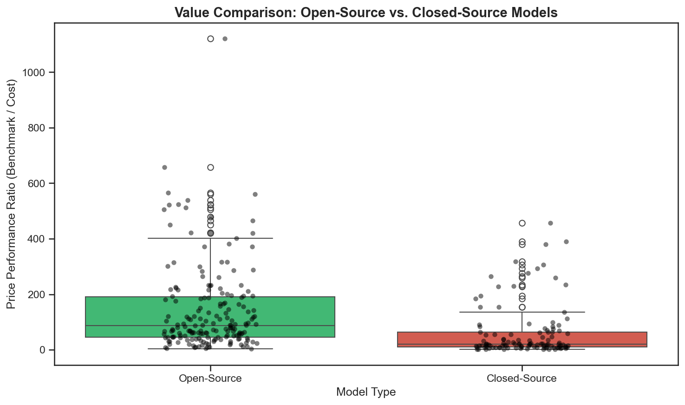

# 🤖 LLM Benchmarks Analysis (2024 – 2026)

## 📌 Project Overview

This project presents a comprehensive analysis of Large Language Models (LLMs) released between 2024 and 2026.

The goal of this study is to compare models based on multiple aspects, including:

* Performance
* Cost efficiency
* Safety
* Parameter sizes
* Open-source vs. closed-source capabilities
* Overall value for money

---

## 📊 Dataset

The analysis is based on the dataset:

`llm_price_performance_tracker.csv`

The dataset contains information about various LLMs, including their providers, benchmark performance, pricing, safety scores, and model characteristics.

---

## 🛠 Technologies Used

* Python
* Pandas
* NumPy
* Matplotlib
* Seaborn
* Jupyter Notebook

---

## 🔍 Analysis Sections

### 1. Data Cleaning & Preparation

* Handling missing values
* Fixing data types
* Cleaning text columns
* Categorizing providers and models

### 2. Exploring the LLM Landscape

Identifying major providers and understanding the distribution of available models.

### 3. Performance Analysis

Investigating benchmark scores and identifying top-performing models.

### 4. Cost Analysis

Studying pricing trends and comparing cost efficiency.

### 5. Value for Money

Determining which models provide the best balance between price and performance.

### 6. Safety Analysis

Comparing safety scores among providers and models.

### 7. Open-Source vs Closed-Source Models

A detailed comparison between open and proprietary models.

---

## 📈 Visualizations

The project includes several visualizations such as:

* Parameters Distribution

<p align="center">

</p>

* Safety Comparison
  
<p align="center">

</p>

* Cost vs Performance Analysis

<p align="center">

</p>

* Best Value Models

<p align="center">

</p>

* Open vs Closed Source Comparison

<p align="center">

</p>

* Correlation Matrix of Key Performance Metrics

<p align="center">

</p>

---

## 🚀 How to Run

Clone the repository:

```bash
git clone https://github.com/Mohamed6186/LLM-Benchmarks-Analysis.git
```

Install dependencies:

```bash
pip install pandas numpy matplotlib seaborn
```

Launch Jupyter Notebook:

```bash
jupyter notebook
```

---

## 🎯 Key Takeaways

This project demonstrates practical skills in:

* Data Cleaning
* Exploratory Data Analysis (EDA)
* Data Visualization
* Comparative Analysis
* Storytelling with Data

---

⭐ Feedback and suggestions are always welcome.
